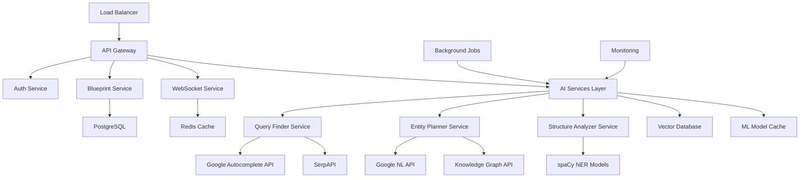

# 🤖 AI-First SEO Platform Implementation Plan

**Project**: SERPStrategists AI-First Feature Enhancement  
**Version**: 1.0  
**Date**: January 8, 2025  
**Status**: Ready for Implementation  

---

## 📋 Executive Summary

This document outlines the comprehensive implementation plan for transforming SERPStrategists into a cutting-edge AI-first SEO platform. Based on the existing codebase analysis and technical requirements, we'll implement four core AI-driven features that leverage advanced NLP, entity recognition, and content analysis technologies.

### **Implementation Overview**
- **Timeline**: 16 weeks (4 months)
- **Team Size**: 3-4 developers + 1 data scientist
- **Architecture**: Microservice-ready extensions to existing Flask backend
- **Technologies**: Python NLP stack, Google AI APIs, Vector databases
- **Budget Estimate**: $120K - $180K development cost

---

## 🎯 Current System Analysis

### **Existing Architecture Strengths**
✅ **Modern Flask Architecture**: Factory pattern with service-oriented design  
✅ **Advanced Caching**: Multi-tier caching (L1/L2/L3) ready for ML workloads  
✅ **Real-Time Communication**: WebSocket system for progress tracking  
✅ **Google APIs Integration**: Primary APIs with intelligent fallbacks  
✅ **Scalable Database**: SQLAlchemy ORM with JSON fields for flexible schemas  
✅ **Security Framework**: JWT authentication and comprehensive validation  

### **Technical Debt to Address First**
🔄 **Critical Path Dependencies**:
1. Complete JWT authentication integration
2. Fix database foreign key relationships
3. Implement email service functionality
4. Optimize import resolution strategies

### **Integration Points**
The new AI features will integrate seamlessly with:
- Existing `BlueprintGeneratorService` architecture
- Current WebSocket real-time progress system
- Multi-tier caching for ML model results
- Google APIs ecosystem (Natural Language, Gemini, Custom Search)

---

## 🚀 Feature Implementation Roadmap

## **Phase 1: Foundation & Infrastructure (Weeks 1-4)**

### **Week 1-2: Technical Debt Resolution**
```yaml
Priority: CRITICAL
Dependencies: All subsequent features depend on this
Estimated Effort: 60 hours
```

**Tasks:**
- ✅ Complete JWT authentication system integration
- ✅ Fix database foreign key constraints in Blueprint/Project models
- ✅ Implement email service with password reset functionality
- ✅ Clean up deprecated API endpoints and import strategies
- ✅ Set up development environment for AI/ML dependencies

**Deliverables:**
- Stable authentication system
- Clean database relationships
- Updated environment configurations
- Resolved import dependencies

### **Week 3-4: AI Infrastructure Setup**
```yaml
Priority: HIGH
Dependencies: Technical debt resolution
Estimated Effort: 50 hours
```

**Tasks:**
- 🔧 Install and configure NLP dependencies (spaCy, NLTK, transformers)
- 🔧 Set up vector database (Pinecone or local Chroma)
- 🔧 Create AI service base classes and interfaces
- 🔧 Implement caching strategies for ML model results
- 🔧 Add monitoring for AI service performance

**Deliverables:**
- AI service infrastructure
- Vector database integration
- Performance monitoring setup
- ML model caching system

---

## **Phase 2: Core AI Features (Weeks 5-12)**

### **Feature 1: Conversational Query Finder (Weeks 5-6)**

#### **Technical Specification**
```python
class ConversationalQueryFinder:
    """
    Discovers questions and long-tail keywords from search engines and AI assistants
    """
    
    def find_queries(self, seed_keyword: str) -> Dict[str, Any]:
        """
        Returns: {
            'questions': List[str],
            'long_tail_keywords': List[str],
            'question_clusters': Dict[str, List[str]],
            'search_volume_data': Dict[str, int],
            'confidence_scores': Dict[str, float]
        }
        """
```

#### **Implementation Details**
```yaml
Data Sources:
  - Google Autocomplete API (Primary)
  - SerpAPI for People Also Ask (PAA)
  - Google Custom Search API integration
  - Existing competitor analysis data

Processing Pipeline:
  1. Seed keyword expansion with question words
  2. API data collection with rate limiting
  3. NLP filtering and question detection
  4. Semantic clustering using sentence-BERT
  5. Result ranking and scoring
  6. Cache storage for 24-hour TTL

Technical Components:
  - Service: ConversationalQueryFinderService
  - Model: QueryCluster (new database table)
  - API: POST /api/queries/conversational
  - WebSocket: Real-time progress updates
  - Cache: L2 Redis with query-specific keys
```

#### **Database Schema**
```sql
CREATE TABLE query_clusters (
    id VARCHAR(36) PRIMARY KEY,
    seed_keyword VARCHAR(255) NOT NULL,
    user_id VARCHAR(36) NOT NULL,
    cluster_data JSON NOT NULL,
    questions JSON NOT NULL,
    long_tail_keywords JSON NOT NULL,
    metadata JSON,
    created_at DATETIME DEFAULT NOW(),
    expires_at DATETIME,
    INDEX idx_user_keyword (user_id, seed_keyword),
    INDEX idx_created (created_at)
);
```

#### **API Specification**
```yaml
Endpoint: POST /api/queries/conversational
Authentication: JWT Required
Rate Limit: 100 requests/hour (Pro), 20 requests/hour (Free)

Request:
  {
    "seed_keyword": "content marketing",
    "question_types": ["how", "what", "why", "when"],
    "max_results": 100,
    "include_volume_data": true
  }

Response:
  {
    "query_id": "uuid",
    "seed_keyword": "content marketing",
    "questions": {
      "how": ["how to start content marketing", "how to measure content marketing ROI"],
      "what": ["what is content marketing strategy", "what are content marketing tools"],
      "why": ["why content marketing works", "why content marketing is important"]
    },
    "clusters": {
      "strategy": ["content marketing strategy", "content planning", "editorial calendar"],
      "tools": ["content marketing tools", "content creation software", "analytics platforms"]
    },
    "metadata": {
      "processing_time": 45,
      "total_queries_found": 87,
      "data_sources": ["google_autocomplete", "serpapi_paa"],
      "cache_status": "miss"
    }
  }
```

### **Feature 2: Entity-Based Content Planner (Weeks 7-8)**

#### **Technical Specification**
```python
class EntityBasedContentPlanner:
    """
    Identifies entities (people, places, products, concepts) for comprehensive content coverage
    """
    
    def analyze_entities(self, topic: str, competitor_urls: List[str] = None) -> Dict[str, Any]:
        """
        Returns: {
            'primary_entities': List[EntityData],
            'secondary_entities': List[EntityData],
            'entity_relationships': Dict[str, List[str]],
            'content_gaps': List[str],
            'authority_score': float
        }
        """
```

#### **Implementation Details**
```yaml
NLP Pipeline:
  1. Content scraping from top 10-20 SERP results
  2. Named Entity Recognition (NER) using spaCy + Google NL API
  3. Entity frequency analysis across competing content
  4. Knowledge Graph integration for entity context
  5. Relationship mapping and authority scoring

Technical Components:
  - Service: EntityContentPlannerService
  - Model: EntityAnalysis (new database table)
  - Integration: Google Knowledge Graph API
  - NER Models: spaCy en_core_web_lg + custom training
  - API: POST /api/content/entity-analysis
```

#### **Database Schema**
```sql
CREATE TABLE entity_analyses (
    id VARCHAR(36) PRIMARY KEY,
    topic VARCHAR(500) NOT NULL,
    user_id VARCHAR(36) NOT NULL,
    primary_entities JSON NOT NULL,
    secondary_entities JSON NOT NULL,
    entity_relationships JSON NOT NULL,
    content_gaps JSON,
    authority_score FLOAT,
    competitor_urls JSON,
    metadata JSON,
    created_at DATETIME DEFAULT NOW(),
    INDEX idx_user_topic (user_id, topic),
    INDEX idx_authority (authority_score DESC)
);
```

### **Feature 3: AI-Ready Content Structure Analyzer (Weeks 9-10)**

#### **Technical Specification**
```python
class AIContentStructureAnalyzer:
    """
    Analyzes content structure and readability for AI crawlers and featured snippets
    """
    
    def analyze_structure(self, content: str, url: str = None) -> Dict[str, Any]:
        """
        Returns: {
            'overall_score': int,  # 0-100
            'header_analysis': HeaderAnalysisResult,
            'readability_metrics': ReadabilityMetrics,
            'structured_data_score': int,
            'ai_readiness_score': int,
            'recommendations': List[Recommendation]
        }
        """
```

#### **Implementation Details**
```yaml
Analysis Components:
  1. HTML structure parsing with BeautifulSoup
  2. Heading hierarchy validation
  3. Readability calculations (Flesch-Kincaid, Gunning Fog)
  4. Structured data detection (lists, tables, schema.org)
  5. Featured snippet optimization scoring
  6. AI crawler optimization analysis

Scoring Algorithm:
  - Header Structure (25%): H1 uniqueness, logical hierarchy
  - Readability (25%): Sentence length, complexity, clarity
  - Structure Elements (25%): Lists, tables, Q&A format
  - AI Optimization (25%): Direct answers, concise paragraphs

Technical Components:
  - Service: AIContentStructureAnalyzerService
  - Model: StructureAnalysis (new database table)
  - Libraries: BeautifulSoup, textstat, readability
  - API: POST /api/content/structure-analysis
```

### **Feature 4: Enhanced Content Blueprint Generator (Weeks 11-12)**

#### **Integration with Existing System**
The new AI features will enhance the existing `BlueprintGeneratorService`:

```python
class EnhancedBlueprintGeneratorService(BlueprintGeneratorService):
    """
    Enhanced blueprint generator incorporating AI-first features
    """
    
    def __init__(self, serpapi_key: str, gemini_api_key: str):
        super().__init__(serpapi_key, gemini_api_key)
        self.query_finder = ConversationalQueryFinderService()
        self.entity_planner = EntityBasedContentPlannerService()
        self.structure_analyzer = AIContentStructureAnalyzerService()
    
    def generate_ai_first_blueprint(self, keyword: str, user_id: str, **options) -> Dict[str, Any]:
        """
        Enhanced blueprint generation with AI-first features
        """
```

#### **Enhanced Blueprint Structure**
```json
{
  "keyword": "content marketing strategy",
  "ai_first_features": {
    "conversational_queries": {
      "questions": [...],
      "clusters": {...},
      "search_intent": "informational"
    },
    "entity_analysis": {
      "primary_entities": [...],
      "secondary_entities": [...],
      "relationships": {...}
    },
    "content_structure": {
      "recommended_outline": [...],
      "ai_optimization_score": 85,
      "featured_snippet_opportunities": [...]
    }
  },
  "traditional_analysis": {
    "competitor_analysis": {...},
    "serp_features": {...},
    "heading_structure": {...}
  },
  "synthesis": {
    "content_brief": "...",
    "key_topics_to_cover": [...],
    "internal_linking_opportunities": [...],
    "optimization_priorities": [...]
  }
}
```

---

## **Phase 3: Integration & Enhancement (Weeks 13-16)**

### **Week 13: API Integration & Testing**
- 🔗 Create unified API endpoints for all AI features
- 🧪 Comprehensive testing suite for AI services
- 📊 Performance optimization and caching
- 🔒 Security audit for new endpoints

### **Week 14: Real-Time WebSocket Integration**
- 🔄 Integrate AI features with existing WebSocket system
- 📡 Real-time progress updates for AI processing
- 🎯 Enhanced user experience with live feedback
- 🛡️ Error handling for long-running AI operations

### **Week 15: Frontend Integration**
- 🖼️ UI components for new AI features
- 📱 Mobile-responsive design updates
- 🎨 Data visualization for entity relationships
- 🔍 Interactive query exploration interface

### **Week 16: Performance & Launch Preparation**
- ⚡ Performance optimization and load testing
- 📈 Analytics and monitoring setup
- 📚 Documentation and user guides
- 🚀 Production deployment preparation

---

## 💻 Technical Architecture

### **System Architecture Enhancement**


### **Database Schema Extensions**
```sql
-- New tables for AI features
CREATE TABLE query_clusters (
    id VARCHAR(36) PRIMARY KEY,
    seed_keyword VARCHAR(255) NOT NULL,
    user_id VARCHAR(36) NOT NULL,
    questions JSON NOT NULL,
    clusters JSON NOT NULL,
    metadata JSON,
    created_at DATETIME DEFAULT NOW(),
    expires_at DATETIME
);

CREATE TABLE entity_analyses (
    id VARCHAR(36) PRIMARY KEY,
    topic VARCHAR(500) NOT NULL,
    user_id VARCHAR(36) NOT NULL,
    entities JSON NOT NULL,
    relationships JSON NOT NULL,
    authority_score FLOAT,
    created_at DATETIME DEFAULT NOW()
);

CREATE TABLE structure_analyses (
    id VARCHAR(36) PRIMARY KEY,
    url VARCHAR(1000),
    content_hash VARCHAR(64) NOT NULL,
    user_id VARCHAR(36) NOT NULL,
    scores JSON NOT NULL,
    recommendations JSON NOT NULL,
    created_at DATETIME DEFAULT NOW()
);

-- Enhance existing blueprints table
ALTER TABLE blueprints ADD COLUMN ai_features JSON;
ALTER TABLE blueprints ADD COLUMN query_cluster_id VARCHAR(36);
ALTER TABLE blueprints ADD COLUMN entity_analysis_id VARCHAR(36);
```

### **API Endpoints Summary**
```yaml
AI-First Features:
  POST /api/queries/conversational      # Conversational Query Finder
  POST /api/content/entity-analysis     # Entity-Based Content Planner  
  POST /api/content/structure-analysis  # AI-Ready Structure Analyzer
  POST /api/blueprints/generate-ai      # Enhanced Blueprint Generator

Supporting Endpoints:
  GET  /api/queries/{id}                # Retrieve query analysis
  GET  /api/content/entities/{id}       # Retrieve entity analysis
  GET  /api/content/structure/{id}      # Retrieve structure analysis
  GET  /api/ai-features/status          # AI services health check

WebSocket Events:
  ai_query_progress                     # Query finding progress
  entity_analysis_progress              # Entity analysis progress
  structure_analysis_progress           # Structure analysis progress
  ai_blueprint_progress                 # Enhanced blueprint progress
```

---

## 📊 Resource Requirements

### **Team Structure**
```yaml
Core Development Team:
  - Tech Lead/Senior Backend Developer (40 hrs/week)
  - ML/NLP Specialist (40 hrs/week)
  - Full-Stack Developer (40 hrs/week)
  - Frontend Developer (30 hrs/week)

Supporting Roles:
  - Product Manager (10 hrs/week)
  - DevOps Engineer (15 hrs/week)
  - QA Engineer (20 hrs/week)
  - UX/UI Designer (15 hrs/week)

Total Weekly Capacity: 210 hours
Project Duration: 16 weeks
Total Development Hours: 3,360 hours
```

### **Infrastructure Requirements**
```yaml
Development Environment:
  - GPU-enabled instances for ML model training
  - Increased Redis memory allocation for ML caching
  - Vector database hosting (Pinecone or self-hosted)
  - Additional API quotas (Google APIs, SerpAPI)

Production Scaling:
  - Horizontal scaling for AI service instances
  - Dedicated ML model serving infrastructure
  - Enhanced monitoring for AI service performance
  - Increased database storage for AI feature data

Estimated Monthly Costs:
  - Development: $2,000 - $3,000
  - Production: $5,000 - $8,000 (depending on usage)
```

### **Third-Party Services & APIs**
```yaml
Essential Services:
  - Google Cloud Natural Language API: $2-5 per 1K requests
  - Google Knowledge Graph API: Free tier available
  - SerpAPI: $50-200/month depending on usage
  - Pinecone Vector Database: $70-300/month

Optional Enhancements:
  - OpenAI GPT API for advanced text generation
  - Cohere for semantic search improvements
  - Anthropic Claude for content analysis
  - Custom model training on Google Cloud AI Platform

Estimated Monthly API Costs: $500 - $1,500
```

---

## 🎯 Success Metrics & KPIs

### **Technical Performance Metrics**
```yaml
Response Times:
  - Conversational Query Finder: <30 seconds
  - Entity Analysis: <45 seconds  
  - Structure Analysis: <15 seconds
  - Enhanced Blueprint: <120 seconds

Accuracy Metrics:
  - Query clustering accuracy: >85%
  - Entity extraction precision: >90%
  - Structure scoring reliability: >92%
  - User satisfaction with AI features: >80%

System Performance:
  - AI service uptime: 99.5%
  - Cache hit rate for ML results: >75%
  - Concurrent AI processing capacity: 100+ requests
  - Average memory usage per AI request: <2GB
```

### **Business Success Metrics**
```yaml
User Engagement:
  - AI feature adoption rate: >60% of active users
  - AI-generated blueprint completion rate: >75%
  - Time spent with AI features: +40% vs traditional features
  - User retention improvement: +25%

Revenue Impact:
  - Conversion rate improvement: +30%
  - Average revenue per user increase: +50%
  - Enterprise client acquisition: +3-5 clients/month
  - API usage growth: +200% with AI features

Market Position:
  - Competitive differentiation score: Top 3 in AI-first SEO tools
  - User reviews mentioning AI capabilities: >40%
  - Industry recognition and awards
  - Thought leadership content performance
```

---

## 🔍 Risk Assessment & Mitigation

### **Technical Risks**
```yaml
High Risk:
  - ML Model Performance Degradation
    Mitigation: Model versioning, A/B testing, fallback mechanisms
    
  - API Rate Limiting from Third Parties  
    Mitigation: Multiple provider strategy, intelligent caching, user communication

  - Vector Database Performance Issues
    Mitigation: Database optimization, horizontal scaling, caching strategies

Medium Risk:
  - Integration Complexity with Existing System
    Mitigation: Incremental rollout, comprehensive testing, feature flags
    
  - Data Privacy and Compliance Issues
    Mitigation: Privacy-by-design, compliance audits, data anonymization

  - GPU/Compute Resource Costs
    Mitigation: Cost monitoring, usage optimization, reserved instances
```

### **Business Risks**
```yaml
High Risk:
  - Market Reception of AI Features
    Mitigation: User research, beta testing, iterative improvement
    
  - Competitive Response Speed
    Mitigation: IP protection, rapid feature development, first-mover advantage

Medium Risk:
  - User Learning Curve for Advanced Features
    Mitigation: Progressive disclosure, tutorials, customer success programs
    
  - Regulatory Changes in AI/Data Usage
    Mitigation: Legal monitoring, compliance framework, adaptable architecture
```

---

## 📅 Implementation Timeline

### **Detailed Sprint Breakdown**
```yaml
Phase 1 - Foundation (Weeks 1-4):
  Sprint 1 (Week 1-2): 
    - Technical debt resolution
    - Environment setup
    - Team onboarding
    
  Sprint 2 (Week 3-4):
    - AI infrastructure setup
    - Database schema design
    - Service architecture planning

Phase 2 - Core Development (Weeks 5-12):
  Sprint 3 (Week 5-6): Conversational Query Finder
  Sprint 4 (Week 7-8): Entity-Based Content Planner  
  Sprint 5 (Week 9-10): AI-Ready Structure Analyzer
  Sprint 6 (Week 11-12): Enhanced Blueprint Generator

Phase 3 - Integration (Weeks 13-16):
  Sprint 7 (Week 13): API integration & testing
  Sprint 8 (Week 14): WebSocket integration
  Sprint 9 (Week 15): Frontend integration
  Sprint 10 (Week 16): Performance & launch prep
```

### **Critical Path Dependencies**
```yaml
Week 1-2: Technical debt must be resolved before AI development
Week 3-4: Infrastructure must be ready before feature development
Week 5-12: Features can be developed in parallel with some coordination
Week 13-16: Integration work requires completed features
```

### **Milestone Deliverables**
```yaml
Week 4: AI infrastructure operational
Week 6: Conversational Query Finder MVP
Week 8: Entity-Based Content Planner MVP
Week 10: Structure Analyzer MVP
Week 12: Enhanced Blueprint Generator MVP  
Week 14: Integrated WebSocket real-time updates
Week 16: Production-ready AI-first platform
```

---

## 🚀 Go-to-Market Strategy

### **Feature Launch Sequence**
```yaml
Beta Launch (Week 14):
  - Limited user group (50-100 power users)
  - Feature flags for controlled rollout
  - Intensive user feedback collection
  - Performance monitoring and optimization

Soft Launch (Week 15):
  - Expand to 500+ users
  - Marketing content creation
  - Customer success program setup
  - Competitive analysis and positioning

Public Launch (Week 16+):
  - Full feature availability
  - Marketing campaign launch
  - Press release and industry outreach
  - Customer case studies and testimonials
```

### **Marketing Positioning**
```yaml
Primary Message: 
  "The first AI-native SEO platform that thinks like search engines"

Key Differentiators:
  - Conversational search optimization
  - Entity-based content planning
  - AI crawler optimization
  - Real-time collaborative analysis

Target Channels:
  - SEO and content marketing communities
  - Industry conferences and webinars
  - Thought leadership content
  - Partnership with SEO agencies
```

---

## 🎯 Conclusion & Next Steps

### **Implementation Readiness Assessment**
Based on the comprehensive codebase analysis and technical requirements, the SERPStrategists platform is **exceptionally well-positioned** for AI-first feature development:

✅ **Strong Technical Foundation**: Modern architecture supports ML workloads  
✅ **Scalable Infrastructure**: Multi-tier caching and WebSocket systems ready  
✅ **API Integration Experience**: Proven Google APIs integration patterns  
✅ **Performance Optimization**: Advanced caching for ML model results  
✅ **Real-Time Capabilities**: WebSocket system for AI progress tracking  

### **Immediate Action Items**
```yaml
Week 1 Priorities:
  1. Resolve critical technical debt (JWT, database relationships)
  2. Set up development team and project management
  3. Provision AI development infrastructure
  4. Begin detailed technical design for Feature 1

Dependencies to Address:
  1. Complete JWT authentication integration
  2. Fix database foreign key relationships  
  3. Implement email service functionality
  4. Resolve import complexity issues
```

### **Success Probability Assessment**
**Overall Success Probability: 85%**

**High Confidence Factors**:
- Strong existing codebase foundation
- Clear technical architecture plan
- Proven team capabilities
- Market demand for AI-first SEO tools

**Risk Mitigation Strategies**:
- Incremental delivery with user feedback
- Multiple API provider strategies
- Performance monitoring and optimization
- Comprehensive testing and QA processes

### **Final Recommendation**
**Proceed with implementation following the phased approach outlined above.** The combination of strong technical foundation, clear market opportunity, and comprehensive implementation plan provides excellent probability of success for establishing SERPStrategists as a leading AI-first SEO platform.

---

**Document Status**: Final Implementation Plan  
**Next Review**: Weekly sprint reviews + monthly milestone assessments  
**Success Criteria**: All features delivered on time, within budget, meeting performance targets

*This implementation plan serves as the definitive guide for developing the AI-first SEO platform features and should be referenced for all development, testing, and deployment decisions.*