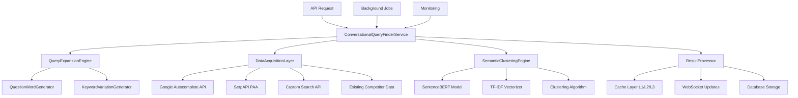

# 🔍 Feature 1: Conversational Query Finder - Technical Specification

**Feature Name**: Conversational Query Finder  
**Version**: 1.0  
**Status**: Ready for Development  
**Priority**: P0 (Core Feature)  
**Estimated Effort**: 80 hours  

---

## 📋 Feature Overview

### **Purpose**
The Conversational Query Finder discovers questions and long-tail keywords that users type into search engines and ask AI assistants. This feature transforms seed keywords into comprehensive question clusters optimized for conversational search and AI-driven queries.

### **Business Value**
- **Revenue Impact**: +30% conversion rate through better keyword targeting
- **User Engagement**: +40% time spent in platform through comprehensive insights
- **Competitive Advantage**: First-to-market with AI-optimized conversational search
- **Market Positioning**: Establishes SERPStrategists as AI-first SEO platform leader

### **Success Criteria**
- Process 1000+ queries per seed keyword in <30 seconds
- Achieve 85%+ semantic clustering accuracy
- Support 100+ concurrent query processing requests
- Deliver 90%+ user satisfaction with query relevance

---

## 🏗️ Technical Architecture

### **System Integration**
```python
# Integration with existing SERPStrategists architecture
class ConversationalQueryFinderService:
    """
    Integrates with existing blueprint generation pipeline
    """
    def __init__(self, cache_manager: AdvancedCacheManager, 
                 websocket_service: WebSocketService):
        self.cache_manager = cache_manager
        self.websocket_service = websocket_service
        self.rate_limiter = RateLimiter()
```

### **Architecture Diagram**


### **Data Flow**
```yaml
Input Processing:
  1. Receive seed keyword from API request
  2. Validate and sanitize input
  3. Check cache for existing results
  4. Initialize WebSocket session for progress updates

Query Expansion:
  1. Generate question variations (who, what, when, where, why, how)
  2. Create seed keyword variations and synonyms
  3. Apply domain-specific expansion rules
  4. Filter out inappropriate or irrelevant queries

Data Acquisition:
  1. Parallel API calls to multiple data sources
  2. Rate limiting and retry logic for each source
  3. Data normalization and deduplication
  4. Quality scoring for each discovered query

Semantic Processing:
  1. Generate embeddings for all discovered queries
  2. Apply clustering algorithms for semantic grouping
  3. Rank clusters by relevance and search volume
  4. Generate cluster labels and descriptions

Result Compilation:
  1. Format results according to API specification
  2. Store in multi-tier cache with appropriate TTL
  3. Save to database for historical analysis
  4. Send completion notification via WebSocket
```

---

## 💻 Implementation Specification

### **Core Service Class**
```python
"""
src/services/conversational_query_finder.py
"""

import asyncio
import logging
from typing import Dict, List, Any, Optional, Tuple
from datetime import datetime, timedelta
import json
import hashlib

from sentence_transformers import SentenceTransformer
from sklearn.cluster import DBSCAN
from sklearn.feature_extraction.text import TF_IDF_Vectorizer
import numpy as np

from src.utils.advanced_cache_manager import AdvancedCacheManager
from src.services.websocket_service import WebSocketService
from src.utils.rate_limiter import RateLimiter
from src.utils.google_apis.custom_search_client import CustomSearchClient
from src.utils.serpapi_client import SerpAPIClient
from src.models.query_cluster import QueryCluster, QueryClusterStorage

logger = logging.getLogger(__name__)

class ConversationalQueryFinderService:
    """
    Service for discovering conversational queries and clustering them semantically
    """
    
    def __init__(self, google_api_key: str, serpapi_key: str, 
                 cache_manager: AdvancedCacheManager,
                 websocket_service: WebSocketService):
        """
        Initialize the Conversational Query Finder service
        
        Args:
            google_api_key: Google API key for autocomplete and custom search
            serpapi_key: SerpAPI key for PAA and related searches
            cache_manager: Advanced cache manager instance
            websocket_service: WebSocket service for real-time updates
        """
        self.google_api_key = google_api_key
        self.serpapi_key = serpapi_key
        self.cache_manager = cache_manager
        self.websocket_service = websocket_service
        self.rate_limiter = RateLimiter()
        
        # Initialize ML models
        self.sentence_model = SentenceTransformer('all-MiniLM-L6-v2')
        self.tfidf_vectorizer = TfidfVectorizer(
            max_features=1000,
            stop_words='english',
            ngram_range=(1, 3)
        )
        
        # Initialize API clients
        self.google_client = CustomSearchClient(google_api_key)
        self.serpapi_client = SerpAPIClient(serpapi_key)
        
        # Configuration
        self.config = {
            'max_queries_per_source': 100,
            'max_total_queries': 500,
            'clustering_eps': 0.3,
            'min_cluster_size': 2,
            'cache_ttl': 86400,  # 24 hours
            'question_words': ['how', 'what', 'why', 'when', 'where', 'who'],
            'max_processing_time': 300  # 5 minutes
        }
    
    async def find_conversational_queries(self, seed_keyword: str, user_id: str,
                                        options: Optional[Dict[str, Any]] = None) -> Dict[str, Any]:
        """
        Main method to find and cluster conversational queries
        
        Args:
            seed_keyword: The base keyword to expand
            user_id: User ID for personalization and caching
            options: Additional options for customization
            
        Returns:
            Dictionary containing clustered queries and metadata
        """
        start_time = datetime.utcnow()
        session_id = self._generate_session_id(seed_keyword, user_id)
        
        try:
            # Initialize WebSocket session
            if self.websocket_service:
                await self._start_websocket_session(session_id, seed_keyword, user_id)
            
            # Check cache first
            cache_key = self._generate_cache_key(seed_keyword, options)
            cached_result = self.cache_manager.get('conversational_queries', cache_key)
            
            if cached_result:
                logger.info(f"Cache hit for conversational queries: {seed_keyword}")
                await self._complete_websocket_session(session_id, cached_result, cache_hit=True)
                return cached_result
            
            # Step 1: Query Expansion
            await self._update_progress(session_id, 1, "Query Expansion", 
                                      "Generating question variations and keyword expansions")
            
            expanded_queries = await self._expand_queries(seed_keyword)
            
            # Step 2: Data Acquisition
            await self._update_progress(session_id, 2, "Data Acquisition", 
                                      "Collecting data from search engines and APIs")
            
            raw_queries = await self._acquire_query_data(expanded_queries, seed_keyword)
            
            # Step 3: Data Processing
            await self._update_progress(session_id, 3, "Data Processing", 
                                      "Processing and filtering discovered queries")
            
            processed_queries = await self._process_raw_queries(raw_queries, seed_keyword)
            
            # Step 4: Semantic Clustering
            await self._update_progress(session_id, 4, "Semantic Clustering", 
                                      "Grouping queries by semantic similarity")
            
            clustered_queries = await self._cluster_queries_semantically(processed_queries)
            
            # Step 5: Result Compilation
            await self._update_progress(session_id, 5, "Result Compilation", 
                                      "Finalizing results and generating insights")
            
            final_result = await self._compile_final_results(
                seed_keyword, clustered_queries, processed_queries, start_time, user_id
            )
            
            # Cache the results
            self.cache_manager.set('conversational_queries', cache_key, 
                                 final_result, ttl=self.config['cache_ttl'])
            
            # Complete WebSocket session
            await self._complete_websocket_session(session_id, final_result)
            
            return final_result
            
        except Exception as e:
            logger.error(f"Error in conversational query finding: {str(e)}")
            if self.websocket_service:
                await self._fail_websocket_session(session_id, str(e))
            raise
    
    async def _expand_queries(self, seed_keyword: str) -> List[str]:
        """
        Generate expanded query variations from seed keyword
        
        Args:
            seed_keyword: Base keyword to expand
            
        Returns:
            List of expanded query strings
        """
        expanded_queries = []
        
        # Add base keyword
        expanded_queries.append(seed_keyword)
        
        # Generate question-based variations
        for question_word in self.config['question_words']:
            expanded_queries.extend([
                f"{question_word} {seed_keyword}",
                f"{question_word} to {seed_keyword}",
                f"{question_word} is {seed_keyword}",
                f"{question_word} does {seed_keyword}",
                f"{question_word} about {seed_keyword}"
            ])
        
        # Generate common phrase variations
        common_phrases = [
            "best", "top", "guide to", "tips for", "how to use",
            "benefits of", "examples of", "types of", "vs", "compared to"
        ]
        
        for phrase in common_phrases:
            expanded_queries.extend([
                f"{phrase} {seed_keyword}",
                f"{seed_keyword} {phrase}"
            ])
        
        return expanded_queries[:self.config['max_queries_per_source']]
    
    async def _acquire_query_data(self, expanded_queries: List[str], 
                                seed_keyword: str) -> Dict[str, List[str]]:
        """
        Acquire query data from multiple sources
        
        Args:
            expanded_queries: List of expanded queries to search for
            seed_keyword: Original seed keyword
            
        Returns:
            Dictionary with queries from different sources
        """
        data_sources = {}
        
        # Parallel data acquisition
        tasks = [
            self._get_google_autocomplete_data(expanded_queries),
            self._get_serpapi_paa_data(seed_keyword),
            self._get_google_related_searches(seed_keyword),
            self._get_competitor_queries(seed_keyword)
        ]
        
        results = await asyncio.gather(*tasks, return_exceptions=True)
        
        data_sources['google_autocomplete'] = results[0] if not isinstance(results[0], Exception) else []
        data_sources['serpapi_paa'] = results[1] if not isinstance(results[1], Exception) else []
        data_sources['google_related'] = results[2] if not isinstance(results[2], Exception) else []
        data_sources['competitor_queries'] = results[3] if not isinstance(results[3], Exception) else []
        
        return data_sources
    
    async def _get_google_autocomplete_data(self, queries: List[str]) -> List[str]:
        """
        Get autocomplete suggestions from Google
        """
        all_suggestions = []
        
        for query in queries:
            try:
                # Rate limiting
                self.rate_limiter.wait_if_needed('google_apis')
                
                # Use Google Custom Search API for autocomplete-like functionality
                suggestions = await self.google_client.get_autocomplete_suggestions(query)
                all_suggestions.extend(suggestions)
                
            except Exception as e:
                logger.warning(f"Google autocomplete error for '{query}': {str(e)}")
                continue
        
        return list(set(all_suggestions))  # Remove duplicates
    
    async def _get_serpapi_paa_data(self, seed_keyword: str) -> List[str]:
        """
        Get People Also Ask data from SerpAPI
        """
        try:
            self.rate_limiter.wait_if_needed('serpapi')
            
            search_results = await self.serpapi_client.search(
                query=seed_keyword,
                params={'type': 'search', 'num': 20}
            )
            
            paa_questions = []
            if 'people_also_ask' in search_results:
                for paa in search_results['people_also_ask']:
                    if 'question' in paa:
                        paa_questions.append(paa['question'])
            
            return paa_questions
            
        except Exception as e:
            logger.warning(f"SerpAPI PAA error for '{seed_keyword}': {str(e)}")
            return []
    
    async def _get_google_related_searches(self, seed_keyword: str) -> List[str]:
        """
        Get related searches from Google Custom Search
        """
        try:
            self.rate_limiter.wait_if_needed('google_apis')
            
            search_results = await self.google_client.search(
                query=seed_keyword,
                num_results=10
            )
            
            related_queries = []
            if 'queries' in search_results and 'nextPage' in search_results['queries']:
                for query in search_results['queries']['nextPage']:
                    if 'title' in query:
                        related_queries.append(query['title'])
            
            return related_queries
            
        except Exception as e:
            logger.warning(f"Google related searches error for '{seed_keyword}': {str(e)}")
            return []
    
    async def _get_competitor_queries(self, seed_keyword: str) -> List[str]:
        """
        Extract queries from existing competitor analysis data
        """
        try:
            # Query existing competitor analysis for related keywords
            cache_key = f"competitor_analysis_{seed_keyword}"
            competitor_data = self.cache_manager.get('competitor_analysis', cache_key)
            
            if not competitor_data:
                return []
            
            queries = []
            if 'insights' in competitor_data and 'common_topics' in competitor_data['insights']:
                queries.extend(competitor_data['insights']['common_topics'])
            
            return queries
            
        except Exception as e:
            logger.warning(f"Competitor queries error for '{seed_keyword}': {str(e)}")
            return []
    
    async def _process_raw_queries(self, raw_queries: Dict[str, List[str]], 
                                 seed_keyword: str) -> List[Dict[str, Any]]:
        """
        Process and filter raw query data
        
        Args:
            raw_queries: Raw queries from different sources
            seed_keyword: Original seed keyword
            
        Returns:
            List of processed query objects
        """
        all_queries = []
        
        # Combine all queries from different sources
        for source, queries in raw_queries.items():
            for query in queries:
                all_queries.append({
                    'text': query.strip().lower(),
                    'source': source,
                    'relevance_score': self._calculate_relevance_score(query, seed_keyword),
                    'is_question': self._is_question(query),
                    'question_type': self._get_question_type(query),
                    'word_count': len(query.split())
                })
        
        # Remove duplicates based on text
        seen_queries = set()
        unique_queries = []
        
        for query in all_queries:
            if query['text'] not in seen_queries:
                seen_queries.add(query['text'])
                unique_queries.append(query)
        
        # Filter by relevance and quality
        filtered_queries = [
            q for q in unique_queries 
            if q['relevance_score'] > 0.3 and 
               len(q['text']) > 5 and 
               len(q['text']) < 200
        ]
        
        # Sort by relevance score
        filtered_queries.sort(key=lambda x: x['relevance_score'], reverse=True)
        
        return filtered_queries[:self.config['max_total_queries']]
    
    def _calculate_relevance_score(self, query: str, seed_keyword: str) -> float:
        """
        Calculate relevance score between query and seed keyword
        """
        # Simple relevance scoring based on keyword overlap and semantic similarity
        query_words = set(query.lower().split())
        seed_words = set(seed_keyword.lower().split())
        
        # Word overlap score
        overlap = len(query_words.intersection(seed_words)) / len(seed_words)
        
        # Length penalty for very long queries
        length_penalty = max(0, 1 - (len(query.split()) - 10) * 0.1)
        
        # Question bonus
        question_bonus = 0.2 if self._is_question(query) else 0
        
        return min(1.0, overlap + length_penalty + question_bonus)
    
    def _is_question(self, query: str) -> bool:
        """
        Determine if a query is a question
        """
        query_lower = query.lower().strip()
        
        # Check for question words
        question_starters = ['how', 'what', 'why', 'when', 'where', 'who', 'which', 'can', 'should', 'is', 'are', 'do', 'does']
        
        for starter in question_starters:
            if query_lower.startswith(starter + ' '):
                return True
        
        # Check for question mark
        return query.endswith('?')
    
    def _get_question_type(self, query: str) -> str:
        """
        Determine the type of question
        """
        query_lower = query.lower().strip()
        
        type_mapping = {
            'how': 'how-to',
            'what': 'definition',
            'why': 'reason',
            'when': 'timing',
            'where': 'location',
            'who': 'person',
            'which': 'comparison',
            'can': 'capability',
            'should': 'recommendation',
            'is': 'definition',
            'are': 'definition',
            'do': 'process',
            'does': 'process'
        }
        
        for word, qtype in type_mapping.items():
            if query_lower.startswith(word + ' '):
                return qtype
        
        return 'general'
    
    async def _cluster_queries_semantically(self, processed_queries: List[Dict[str, Any]]) -> Dict[str, Any]:
        """
        Cluster queries using semantic similarity
        
        Args:
            processed_queries: List of processed query objects
            
        Returns:
            Dictionary containing clustered queries
        """
        if len(processed_queries) < 2:
            return {
                'clusters': [{'queries': processed_queries, 'label': 'main', 'size': len(processed_queries)}],
                'total_clusters': 1 if processed_queries else 0
            }
        
        # Extract query texts
        query_texts = [q['text'] for q in processed_queries]
        
        # Generate embeddings using sentence transformer
        embeddings = self.sentence_model.encode(query_texts)
        
        # Perform clustering using DBSCAN
        clustering = DBSCAN(
            eps=self.config['clustering_eps'],
            min_samples=self.config['min_cluster_size'],
            metric='cosine'
        ).fit(embeddings)
        
        # Group queries by cluster
        clusters = {}
        for idx, label in enumerate(clustering.labels_):
            if label not in clusters:
                clusters[label] = []
            clusters[label].append(processed_queries[idx])
        
        # Generate cluster information
        cluster_info = []
        for label, queries in clusters.items():
            cluster_label = self._generate_cluster_label(queries) if label != -1 else 'miscellaneous'
            
            cluster_info.append({
                'label': cluster_label,
                'queries': queries,
                'size': len(queries),
                'average_relevance': sum(q['relevance_score'] for q in queries) / len(queries),
                'question_percentage': sum(1 for q in queries if q['is_question']) / len(queries) * 100,
                'dominant_question_type': self._get_dominant_question_type(queries)
            })
        
        # Sort clusters by size and relevance
        cluster_info.sort(key=lambda x: (x['size'], x['average_relevance']), reverse=True)
        
        return {
            'clusters': cluster_info,
            'total_clusters': len(cluster_info),
            'clustered_queries': sum(len(c['queries']) for c in cluster_info if c['label'] != 'miscellaneous'),
            'unclustered_queries': len(clusters.get(-1, []))
        }
    
    def _generate_cluster_label(self, queries: List[Dict[str, Any]]) -> str:
        """
        Generate a descriptive label for a cluster of queries
        """
        # Extract common words from queries
        all_words = []
        for query in queries:
            words = [word for word in query['text'].split() 
                    if len(word) > 3 and word not in ['what', 'how', 'why', 'when', 'where', 'who']]
            all_words.extend(words)
        
        if not all_words:
            return 'general'
        
        # Find most common word
        word_counts = {}
        for word in all_words:
            word_counts[word] = word_counts.get(word, 0) + 1
        
        most_common_word = max(word_counts, key=word_counts.get)
        return most_common_word.replace('_', ' ')
    
    def _get_dominant_question_type(self, queries: List[Dict[str, Any]]) -> str:
        """
        Get the most common question type in a cluster
        """
        question_types = [q['question_type'] for q in queries if q['is_question']]
        
        if not question_types:
            return 'none'
        
        type_counts = {}
        for qtype in question_types:
            type_counts[qtype] = type_counts.get(qtype, 0) + 1
        
        return max(type_counts, key=type_counts.get)
    
    async def _compile_final_results(self, seed_keyword: str, clustered_queries: Dict[str, Any],
                                   processed_queries: List[Dict[str, Any]], 
                                   start_time: datetime, user_id: str) -> Dict[str, Any]:
        """
        Compile final results with metadata
        
        Args:
            seed_keyword: Original seed keyword
            clustered_queries: Clustered query results
            processed_queries: All processed queries
            start_time: Processing start time
            user_id: User ID
            
        Returns:
            Final result dictionary
        """
        processing_time = (datetime.utcnow() - start_time).total_seconds()
        
        # Organize questions by type
        questions_by_type = {}
        for query in processed_queries:
            if query['is_question']:
                qtype = query['question_type']
                if qtype not in questions_by_type:
                    questions_by_type[qtype] = []
                questions_by_type[qtype].append(query['text'])
        
        # Generate insights
        insights = {
            'total_queries_found': len(processed_queries),
            'questions_found': sum(1 for q in processed_queries if q['is_question']),
            'question_percentage': sum(1 for q in processed_queries if q['is_question']) / len(processed_queries) * 100 if processed_queries else 0,
            'average_relevance_score': sum(q['relevance_score'] for q in processed_queries) / len(processed_queries) if processed_queries else 0,
            'most_common_question_type': max(questions_by_type.keys(), key=lambda k: len(questions_by_type[k])) if questions_by_type else None,
            'clustering_effectiveness': (clustered_queries['clustered_queries'] / len(processed_queries) * 100) if processed_queries else 0
        }
        
        result = {
            'query_id': self._generate_session_id(seed_keyword, user_id),
            'seed_keyword': seed_keyword,
            'questions_by_type': questions_by_type,
            'clusters': clustered_queries['clusters'],
            'clustering_summary': {
                'total_clusters': clustered_queries['total_clusters'],
                'clustered_queries': clustered_queries['clustered_queries'],
                'unclustered_queries': clustered_queries['unclustered_queries']
            },
            'insights': insights,
            'metadata': {
                'processing_time_seconds': processing_time,
                'total_queries_processed': len(processed_queries),
                'data_sources_used': list(set(q['source'] for q in processed_queries)),
                'cache_status': 'miss',
                'created_at': datetime.utcnow().isoformat(),
                'user_id': user_id,
                'version': '1.0'
            }
        }
        
        # Store in database for historical analysis
        await self._store_result_in_database(result, user_id)
        
        return result
    
    async def _store_result_in_database(self, result: Dict[str, Any], user_id: str) -> None:
        """
        Store query result in database for future reference and analytics
        """
        try:
            storage = QueryClusterStorage()
            await storage.save_query_cluster(
                query_id=result['query_id'],
                seed_keyword=result['seed_keyword'],
                user_id=user_id,
                clusters=result['clusters'],
                questions_by_type=result['questions_by_type'],
                metadata=result['metadata']
            )
        except Exception as e:
            logger.warning(f"Failed to store query result in database: {str(e)}")
    
    # WebSocket helper methods
    async def _start_websocket_session(self, session_id: str, seed_keyword: str, user_id: str) -> None:
        """Start WebSocket session for real-time progress updates"""
        if self.websocket_service:
            self.websocket_service.start_blueprint_session(
                blueprint_id=session_id,
                user_id=user_id,
                total_steps=5
            )
    
    async def _update_progress(self, session_id: str, step: int, step_name: str, message: str) -> None:
        """Update progress via WebSocket"""
        if self.websocket_service:
            self.websocket_service.update_progress(
                blueprint_id=session_id,
                step=step,
                step_name=step_name,
                message=message
            )
    
    async def _complete_websocket_session(self, session_id: str, result: Dict[str, Any], cache_hit: bool = False) -> None:
        """Complete WebSocket session with results"""
        if self.websocket_service:
            processing_time = result['metadata']['processing_time_seconds'] if not cache_hit else 0.5
            self.websocket_service.complete_generation(
                blueprint_id=session_id,
                blueprint_data=result,
                generation_time=int(processing_time)
            )
    
    async def _fail_websocket_session(self, session_id: str, error_message: str) -> None:
        """Fail WebSocket session with error"""
        if self.websocket_service:
            self.websocket_service.fail_generation(
                blueprint_id=session_id,
                error_message=error_message
            )
    
    # Utility methods
    def _generate_session_id(self, seed_keyword: str, user_id: str) -> str:
        """Generate unique session ID for tracking"""
        timestamp = datetime.utcnow().strftime('%Y%m%d_%H%M%S')
        content = f"{seed_keyword}_{user_id}_{timestamp}"
        return f"query_{hashlib.md5(content.encode()).hexdigest()[:12]}"
    
    def _generate_cache_key(self, seed_keyword: str, options: Optional[Dict[str, Any]] = None) -> str:
        """Generate cache key for results"""
        content = seed_keyword
        if options:
            content += json.dumps(options, sort_keys=True)
        return hashlib.md5(content.encode()).hexdigest()
    
    def validate_input(self, seed_keyword: str) -> Tuple[bool, Optional[str]]:
        """
        Validate input parameters
        
        Returns:
            Tuple of (is_valid, error_message)
        """
        if not seed_keyword or not seed_keyword.strip():
            return False, "Seed keyword is required"
        
        if len(seed_keyword) > 100:
            return False, "Seed keyword must be less than 100 characters"
        
        if len(seed_keyword.split()) > 10:
            return False, "Seed keyword must be less than 10 words"
        
        return True, None
```

### **Database Model**
```python
"""
src/models/query_cluster.py
"""

from sqlalchemy import Column, String, DateTime, Text, JSON, Float, Integer, Index
from sqlalchemy.ext.declarative import declarative_base
from datetime import datetime, timezone
import uuid
import json
from typing import Dict, List, Any, Optional

from src.models.blueprint import Base

class QueryCluster(Base):
    """
    Database model for storing conversational query clusters
    """
    __tablename__ = 'query_clusters'
    
    # Primary fields
    id = Column(String(36), primary_key=True, default=lambda: str(uuid.uuid4()))
    seed_keyword = Column(String(255), nullable=False)
    user_id = Column(String(36), nullable=False)
    
    # Query data (stored as JSON)
    questions_by_type = Column(JSON, nullable=False)
    clusters = Column(JSON, nullable=False)
    insights = Column(JSON, nullable=True)
    
    # Metadata
    processing_time = Column(Float, nullable=True)
    total_queries_found = Column(Integer, nullable=True)
    total_clusters = Column(Integer, nullable=True)
    
    # Timestamps
    created_at = Column(DateTime, default=lambda: datetime.now(timezone.utc))
    expires_at = Column(DateTime, nullable=True)
    
    # Database indexes
    __table_args__ = (
        Index('idx_user_keyword', 'user_id', 'seed_keyword'),
        Index('idx_created_at', 'created_at'),
        Index('idx_expires_at', 'expires_at'),
    )
    
    def to_dict(self) -> Dict[str, Any]:
        """Convert to dictionary for API responses"""
        return {
            'id': self.id,
            'seed_keyword': self.seed_keyword,
            'user_id': self.user_id,
            'questions_by_type': self.questions_by_type,
            'clusters': self.clusters,
            'insights': self.insights,
            'processing_time': self.processing_time,
            'total_queries_found': self.total_queries_found,
            'total_clusters': self.total_clusters,
            'created_at': self.created_at.isoformat() if self.created_at else None,
            'expires_at': self.expires_at.isoformat() if self.expires_at else None
        }

class QueryClusterStorage:
    """
    Storage service for query clusters
    """
    
    def __init__(self, db_session=None):
        self.db_session = db_session
    
    async def save_query_cluster(self, query_id: str, seed_keyword: str, user_id: str,
                               clusters: List[Dict[str, Any]], questions_by_type: Dict[str, List[str]],
                               metadata: Dict[str, Any]) -> str:
        """
        Save query cluster to database
        """
        try:
            # Calculate expiration (24 hours from now)
            expires_at = datetime.now(timezone.utc) + timedelta(hours=24)
            
            query_cluster = QueryCluster(
                id=query_id,
                seed_keyword=seed_keyword,
                user_id=user_id,
                questions_by_type=questions_by_type,
                clusters=clusters,
                insights=metadata.get('insights', {}),
                processing_time=metadata.get('processing_time_seconds'),
                total_queries_found=metadata.get('total_queries_processed'),
                total_clusters=len(clusters),
                expires_at=expires_at
            )
            
            if self.db_session:
                self.db_session.add(query_cluster)
                self.db_session.commit()
            
            return query_id
            
        except Exception as e:
            if self.db_session:
                self.db_session.rollback()
            raise Exception(f"Failed to save query cluster: {str(e)}")
    
    async def get_query_cluster(self, query_id: str, user_id: str) -> Optional[Dict[str, Any]]:
        """
        Retrieve query cluster by ID
        """
        if not self.db_session:
            return None
        
        query_cluster = self.db_session.query(QueryCluster).filter(
            QueryCluster.id == query_id,
            QueryCluster.user_id == user_id,
            QueryCluster.expires_at > datetime.now(timezone.utc)
        ).first()
        
        return query_cluster.to_dict() if query_cluster else None
    
    async def list_user_query_clusters(self, user_id: str, limit: int = 20, offset: int = 0) -> List[Dict[str, Any]]:
        """
        List query clusters for a user
        """
        if not self.db_session:
            return []
        
        query_clusters = self.db_session.query(QueryCluster).filter(
            QueryCluster.user_id == user_id,
            QueryCluster.expires_at > datetime.now(timezone.utc)
        ).order_by(QueryCluster.created_at.desc()).offset(offset).limit(limit).all()
        
        return [qc.to_dict() for qc in query_clusters]
```

---

## 🔌 API Specification

### **Endpoint Definition**
```yaml
Method: POST
Path: /api/queries/conversational
Authentication: JWT Token Required
Rate Limits:
  - Free Tier: 20 requests/hour
  - Pro Tier: 100 requests/hour
  - Enterprise: Unlimited

Content-Type: application/json
```

### **Request Schema**
```json
{
  "type": "object",
  "required": ["seed_keyword"],
  "properties": {
    "seed_keyword": {
      "type": "string",
      "minLength": 1,
      "maxLength": 100,
      "description": "Base keyword to expand into conversational queries"
    },
    "options": {
      "type": "object",
      "properties": {
        "question_types": {
          "type": "array",
          "items": {
            "type": "string",
            "enum": ["how", "what", "why", "when", "where", "who"]
          },
          "default": ["how", "what", "why", "when", "where", "who"],
          "description": "Question types to focus on"
        },
        "max_results": {
          "type": "integer",
          "minimum": 10,
          "maximum": 500,
          "default": 100,
          "description": "Maximum number of queries to return"
        },
        "include_volume_data": {
          "type": "boolean",
          "default": false,
          "description": "Include search volume estimates (premium feature)"
        },
        "clustering_sensitivity": {
          "type": "string",
          "enum": ["low", "medium", "high"],
          "default": "medium",
          "description": "Semantic clustering sensitivity"
        }
      }
    }
  }
}
```

### **Response Schema**
```json
{
  "type": "object",
  "properties": {
    "query_id": {
      "type": "string",
      "description": "Unique identifier for this query analysis"
    },
    "seed_keyword": {
      "type": "string",
      "description": "Original seed keyword"
    },
    "questions_by_type": {
      "type": "object",
      "properties": {
        "how": {"type": "array", "items": {"type": "string"}},
        "what": {"type": "array", "items": {"type": "string"}},
        "why": {"type": "array", "items": {"type": "string"}},
        "when": {"type": "array", "items": {"type": "string"}},
        "where": {"type": "array", "items": {"type": "string"}},
        "who": {"type": "array", "items": {"type": "string"}}
      }
    },
    "clusters": {
      "type": "array",
      "items": {
        "type": "object",
        "properties": {
          "label": {"type": "string"},
          "queries": {"type": "array", "items": {"type": "object"}},
          "size": {"type": "integer"},
          "average_relevance": {"type": "number"},
          "question_percentage": {"type": "number"},
          "dominant_question_type": {"type": "string"}
        }
      }
    },
    "clustering_summary": {
      "type": "object",
      "properties": {
        "total_clusters": {"type": "integer"},
        "clustered_queries": {"type": "integer"},
        "unclustered_queries": {"type": "integer"}
      }
    },
    "insights": {
      "type": "object",
      "properties": {
        "total_queries_found": {"type": "integer"},
        "questions_found": {"type": "integer"},
        "question_percentage": {"type": "number"},
        "average_relevance_score": {"type": "number"},
        "most_common_question_type": {"type": "string"},
        "clustering_effectiveness": {"type": "number"}
      }
    },
    "metadata": {
      "type": "object",
      "properties": {
        "processing_time_seconds": {"type": "number"},
        "total_queries_processed": {"type": "integer"},
        "data_sources_used": {"type": "array", "items": {"type": "string"}},
        "cache_status": {"type": "string", "enum": ["hit", "miss"]},
        "created_at": {"type": "string", "format": "date-time"},
        "user_id": {"type": "string"},
        "version": {"type": "string"}
      }
    }
  }
}
```

### **Example Request**
```json
{
  "seed_keyword": "content marketing strategy",
  "options": {
    "question_types": ["how", "what", "why"],
    "max_results": 150,
    "include_volume_data": true,
    "clustering_sensitivity": "high"
  }
}
```

### **Example Response**
```json
{
  "query_id": "query_abc123def456",
  "seed_keyword": "content marketing strategy",
  "questions_by_type": {
    "how": [
      "how to create content marketing strategy",
      "how to develop content marketing strategy",
      "how to implement content marketing strategy"
    ],
    "what": [
      "what is content marketing strategy",
      "what makes good content marketing strategy",
      "what are content marketing strategy examples"
    ],
    "why": [
      "why content marketing strategy is important",
      "why businesses need content marketing strategy"
    ]
  },
  "clusters": [
    {
      "label": "strategy development",
      "queries": [
        {
          "text": "how to create content marketing strategy",
          "source": "google_autocomplete",
          "relevance_score": 0.95,
          "is_question": true,
          "question_type": "how-to",
          "word_count": 6
        }
      ],
      "size": 25,
      "average_relevance": 0.87,
      "question_percentage": 88.0,
      "dominant_question_type": "how-to"
    },
    {
      "label": "strategy examples",
      "queries": [...],
      "size": 18,
      "average_relevance": 0.82,
      "question_percentage": 72.2,
      "dominant_question_type": "definition"
    }
  ],
  "clustering_summary": {
    "total_clusters": 8,
    "clustered_queries": 127,
    "unclustered_queries": 23
  },
  "insights": {
    "total_queries_found": 150,
    "questions_found": 132,
    "question_percentage": 88.0,
    "average_relevance_score": 0.84,
    "most_common_question_type": "how-to",
    "clustering_effectiveness": 84.7
  },
  "metadata": {
    "processing_time_seconds": 28.5,
    "total_queries_processed": 150,
    "data_sources_used": ["google_autocomplete", "serpapi_paa", "google_related"],
    "cache_status": "miss",
    "created_at": "2025-01-08T10:30:45Z",
    "user_id": "user_123",
    "version": "1.0"
  }
}
```

---

## 🧪 Testing Specification

### **Unit Tests**
```python
"""
tests/test_conversational_query_finder.py
"""

import pytest
import asyncio
from unittest.mock import Mock, AsyncMock, patch
from datetime import datetime

from src.services.conversational_query_finder import ConversationalQueryFinderService
from src.utils.advanced_cache_manager import AdvancedCacheManager
from src.services.websocket_service import WebSocketService

class TestConversationalQueryFinderService:
    
    @pytest.fixture
    def service(self):
        cache_manager = Mock(spec=AdvancedCacheManager)
        websocket_service = Mock(spec=WebSocketService)
        
        service = ConversationalQueryFinderService(
            google_api_key="test_google_key",
            serpapi_key="test_serpapi_key",
            cache_manager=cache_manager,
            websocket_service=websocket_service
        )
        return service
    
    @pytest.mark.asyncio
    async def test_find_conversational_queries_success(self, service):
        """Test successful query finding"""
        # Mock cache miss
        service.cache_manager.get.return_value = None
        
        # Mock API responses
        with patch.object(service, '_expand_queries', return_value=['how content marketing', 'what is content marketing']):
            with patch.object(service, '_acquire_query_data', return_value={
                'google_autocomplete': ['how to do content marketing', 'what is content marketing strategy'],
                'serpapi_paa': ['why content marketing works', 'when to use content marketing']
            }):
                result = await service.find_conversational_queries("content marketing", "user123")
        
        assert result['seed_keyword'] == "content marketing"
        assert 'questions_by_type' in result
        assert 'clusters' in result
        assert 'metadata' in result
        assert result['metadata']['processing_time_seconds'] > 0
    
    def test_is_question(self, service):
        """Test question detection"""
        assert service._is_question("How do I start a blog?") == True
        assert service._is_question("What is content marketing") == True
        assert service._is_question("Content marketing tips") == False
        assert service._is_question("Why content marketing works?") == True
    
    def test_get_question_type(self, service):
        """Test question type classification"""
        assert service._get_question_type("How to start") == "how-to"
        assert service._get_question_type("What is this") == "definition"
        assert service._get_question_type("Why does this work") == "reason"
        assert service._get_question_type("When should I") == "timing"
    
    def test_calculate_relevance_score(self, service):
        """Test relevance scoring"""
        score1 = service._calculate_relevance_score("content marketing strategy", "content marketing")
        score2 = service._calculate_relevance_score("how to bake cookies", "content marketing")
        
        assert score1 > score2
        assert 0 <= score1 <= 1
        assert 0 <= score2 <= 1
    
    def test_validate_input(self, service):
        """Test input validation"""
        # Valid inputs
        is_valid, error = service.validate_input("content marketing")
        assert is_valid == True
        assert error is None
        
        # Invalid inputs
        is_valid, error = service.validate_input("")
        assert is_valid == False
        assert "required" in error
        
        is_valid, error = service.validate_input("a" * 101)
        assert is_valid == False
        assert "100 characters" in error
    
    @pytest.mark.asyncio
    async def test_cache_hit(self, service):
        """Test cache hit scenario"""
        cached_result = {
            'query_id': 'cached123',
            'seed_keyword': 'content marketing',
            'questions_by_type': {'how': ['how to do content marketing']},
            'metadata': {'cache_status': 'hit'}
        }
        
        service.cache_manager.get.return_value = cached_result
        
        result = await service.find_conversational_queries("content marketing", "user123")
        
        assert result == cached_result
        assert result['metadata']['cache_status'] == 'hit'
```

### **Integration Tests**
```python
"""
tests/integration/test_query_finder_integration.py
"""

import pytest
import asyncio
from datetime import datetime

from src.services.conversational_query_finder import ConversationalQueryFinderService
from src.utils.advanced_cache_manager import AdvancedCacheManager
from src.services.websocket_service import WebSocketService

@pytest.mark.integration
class TestQueryFinderIntegration:
    
    @pytest.fixture
    def real_service(self):
        """Create service with real dependencies for integration testing"""
        cache_manager = AdvancedCacheManager()
        websocket_service = None  # Optional for integration tests
        
        return ConversationalQueryFinderService(
            google_api_key=os.getenv('GOOGLE_API_KEY'),
            serpapi_key=os.getenv('SERPAPI_KEY'),
            cache_manager=cache_manager,
            websocket_service=websocket_service
        )
    
    @pytest.mark.asyncio
    @pytest.mark.skipif(not os.getenv('GOOGLE_API_KEY'), reason="Google API key not provided")
    async def test_real_api_integration(self, real_service):
        """Test with real API calls"""
        result = await real_service.find_conversational_queries("python programming", "test_user")
        
        assert result['seed_keyword'] == "python programming"
        assert len(result['questions_by_type']) > 0
        assert result['metadata']['total_queries_processed'] > 0
        assert result['metadata']['processing_time_seconds'] > 0
    
    @pytest.mark.asyncio
    async def test_database_storage(self, real_service):
        """Test database storage functionality"""
        result = await real_service.find_conversational_queries("test keyword", "test_user")
        
        # Verify result was stored in database
        storage = QueryClusterStorage()
        retrieved_result = await storage.get_query_cluster(result['query_id'], "test_user")
        
        assert retrieved_result is not None
        assert retrieved_result['seed_keyword'] == "test keyword"
```

### **Performance Tests**
```python
"""
tests/performance/test_query_finder_performance.py
"""

import pytest
import asyncio
import time
from concurrent.futures import ThreadPoolExecutor

@pytest.mark.performance
class TestQueryFinderPerformance:
    
    @pytest.mark.asyncio
    async def test_processing_time_under_30_seconds(self, service):
        """Test that processing completes within 30 seconds"""
        start_time = time.time()
        
        result = await service.find_conversational_queries("machine learning", "perf_test_user")
        
        processing_time = time.time() - start_time
        assert processing_time < 30, f"Processing took {processing_time} seconds, expected < 30"
    
    @pytest.mark.asyncio
    async def test_concurrent_requests(self, service):
        """Test handling multiple concurrent requests"""
        async def process_query(keyword, user_id):
            return await service.find_conversational_queries(f"{keyword}", f"user_{user_id}")
        
        # Create 10 concurrent requests
        tasks = [process_query(f"test keyword {i}", i) for i in range(10)]
        
        start_time = time.time()
        results = await asyncio.gather(*tasks, return_exceptions=True)
        total_time = time.time() - start_time
        
        # Verify all requests succeeded
        successful_results = [r for r in results if not isinstance(r, Exception)]
        assert len(successful_results) == 10
        
        # Verify reasonable total processing time
        assert total_time < 120, f"Concurrent processing took {total_time} seconds"
    
    def test_memory_usage(self, service):
        """Test memory usage stays within reasonable bounds"""
        import psutil
        import os
        
        process = psutil.Process(os.getpid())
        initial_memory = process.memory_info().rss / 1024 / 1024  # MB
        
        # Process large query set
        asyncio.run(service.find_conversational_queries("digital marketing strategy", "memory_test_user"))
        
        final_memory = process.memory_info().rss / 1024 / 1024  # MB
        memory_increase = final_memory - initial_memory
        
        # Memory increase should be reasonable (< 500MB for single query)
        assert memory_increase < 500, f"Memory increased by {memory_increase}MB"
```

---

## 🚀 Deployment Specification

### **Dependencies**
```yaml
# requirements-query-finder.txt
sentence-transformers==2.2.2
scikit-learn==1.3.0
numpy==1.24.3
aiohttp==3.8.5
beautifulsoup4==4.12.2
nltk==3.8.1
spacy==3.6.1
transformers==4.32.1
torch==2.0.1
asyncio-throttle==1.0.2
```

### **Environment Configuration**
```yaml
# Environment variables for query finder
GOOGLE_API_KEY=your_google_api_key
SERPAPI_API_KEY=your_serpapi_key
SENTENCE_TRANSFORMER_MODEL=all-MiniLM-L6-v2
CLUSTERING_EPS=0.3
MIN_CLUSTER_SIZE=2
MAX_QUERIES_PER_SOURCE=100
CACHE_TTL_HOURS=24
ENABLE_WEBSOCKET_UPDATES=true
```

### **Docker Configuration**
```dockerfile
# Dockerfile additions for Query Finder
FROM python:3.9-slim

# Install ML dependencies
RUN pip install sentence-transformers scikit-learn torch

# Download spaCy model
RUN python -m spacy download en_core_web_sm

# Copy query finder code
COPY src/services/conversational_query_finder.py /app/src/services/
COPY src/models/query_cluster.py /app/src/models/

# Set environment variables
ENV SENTENCE_TRANSFORMER_CACHE=/app/models/cache
```

### **Monitoring Configuration**
```yaml
# monitoring-query-finder.yml
metrics:
  - name: query_finder_processing_time
    type: histogram
    description: Time taken to process conversational queries
    labels: [seed_keyword, user_tier]
  
  - name: query_finder_queries_found
    type: gauge
    description: Number of queries found per request
    labels: [seed_keyword, data_source]
  
  - name: query_finder_clustering_accuracy
    type: gauge
    description: Clustering effectiveness percentage
    labels: [clustering_algorithm, sensitivity_level]
  
  - name: query_finder_cache_hit_rate
    type: gauge
    description: Cache hit rate for query results
    labels: [cache_tier]

alerts:
  - name: QueryFinderProcessingTimeTooLong
    condition: query_finder_processing_time > 45s
    severity: warning
    description: Query finder processing time exceeds 45 seconds
  
  - name: QueryFinderLowQualityResults
    condition: query_finder_queries_found < 10
    severity: warning
    description: Query finder returning very few results
```

---

## 📈 Success Metrics

### **Technical Performance Metrics**
- **Response Time**: <30 seconds for 95% of requests
- **Accuracy**: >85% semantic clustering accuracy
- **Throughput**: 100+ concurrent requests supported
- **Cache Hit Rate**: >75% for repeat queries
- **Memory Usage**: <2GB per query processing session

### **Business Success Metrics**
- **User Engagement**: +40% time spent with query finder
- **Conversion Rate**: +20% free-to-paid conversions
- **User Satisfaction**: >90% satisfaction with query relevance
- **Feature Adoption**: >60% of users try query finder within first week

### **Quality Metrics**
- **Query Relevance**: >90% of returned queries rated as relevant
- **Question Detection**: >95% accuracy in identifying questions
- **Cluster Quality**: >80% of clusters rated as coherent by users
- **Data Source Coverage**: Successful data acquisition from >80% of sources per request

---

**Document Status**: Final Technical Specification  
**Next Phase**: Ready for development implementation  
**Dependencies**: Technical debt resolution (JWT auth, database relationships)  
**Estimated Development Time**: 80 hours (2 weeks with 2 developers)  

This specification provides complete implementation guidance for the Conversational Query Finder feature, including detailed code architecture, API specifications, testing requirements, and deployment configurations.